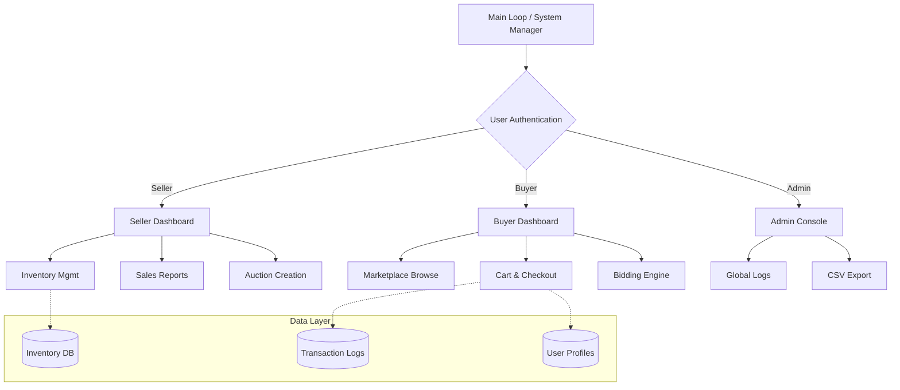

<div align="center">

# 🛒 Pro-Marketplace C++ Ecosystem

### *A High-Performance, Unified Commerce Engine for Modern Trade*

[](https://isocpp.org)
[](https://github.com/)
[](https://en.wikipedia.org/wiki/Object-oriented_programming)

<br/>

> **Pro-Marketplace** is a sophisticated, single-file C++ commerce platform that integrates **real-time auctions, secure wallet transactions, and multi-user dashboard analytics** into a robust, high-performance ecosystem. 

</div>

---

## ✨ Features

- Multi-user system (Buyer, Seller, Admin)
- Product inventory management
- Auction-based bidding system
- Shopping cart and checkout
- Wallet-based payments
- Product reviews and ratings
- Transaction logging
- CSV export for reports

---

## 📋 Table of Contents

- [Core Vision](#-core-vision)
- [Key Features](#-key-features)
- [System Architecture](#-system-architecture)
- [Technical Highlights](#-technical-highlights)
- [Marketplace Dynamics](#-marketplace-dynamics)
- [User Roles](#-user-roles)
- [Data Management](#-data-management)
- [Installation & Usage](#-installation--usage)
- [Example Session](#-example-session)

---

## ⚡ Core Vision

In a world dominated by bloated web frameworks, **Pro-Marketplace** returns to the fundamentals of **computational efficiency and data integrity**. It transforms raw text-file persistence into a dynamic commerce engine capable of handling complex bidding wars, inventory depletion, and financial audits — all within a single, optimized C++ runtime.

| Challenge | Solution |
|---|---|
| 🔴 Data Persistence | Structured File I/O with registry tracking |
| 🔴 Scalability | Optimized STL container management |
| 🔴 Market Dynamics | Duel-mode checkout (Instant Buy vs Auction) |
| 🔴 User Feedback | Integrated Rating & Review system |
| 🔴 Audit Trails | Global transaction logging with CSV export |

---

## 🚀 Key Features

### 💰 Secure Wallet & Fintech Logic
Every user operates with a secure digital wallet. The system handles atomic-style transactions where funds are checked, deducted from buyers, and credited to sellers with 100% mathematical precision.

### 🔨 Real-Time Auction Bidding
Sellers can list "Premium" items for auction. The engine manages a competitive bidding ladder, tracking high bidders and ensuring every new bid exceeds the current threshold.

### 🔔 Smart Notification System
A virtual inbox for every user. Operators receive instant alerts for:
- Sale confirmations for sellers.
- Low-stock warnings for inventory management.
- Outbid alerts for auction participants.

### 📊 Advanced Analytics Dashboards
- **Sellers**: View sales volume, revenue growth, and popularity analysis.
- **Admin**: A global hub for financial auditing and system-wide performance tracking.

### 🔍 Search & Category Filtering
Browse the marketplace with intelligence. Products are categorized (Electronics, Food, Clothing) and searchable via ID or dynamic marketplace listings.

---

## 🏗 System Architecture



---

## 📂 Project Structure

Marketplace-CPP
│
├── marketplace.cpp        # Main application
├── data
│   ├── users              # User account files
│   ├── buyers_list.txt
│   ├── sellers_list.txt
│   ├── transactions.txt
│   └── report.csv
│
├── README.md
└── .gitignore

---

## 💻 Technical Highlights

### 🛠 C++ Mastery
- **Inheritance & Polymorphism**: Unified `User` base class with specialized behaviors for `Buyer`, `Seller`, and `Admin`.
- **STL Optimization**: Utilizes `std::map`, `std::vector`, and `std::stringstream` for high-speed parsing and data organization.
- **Pure Performance**: Focused on low-latency terminal interactions and efficient disk I/O.

### 📂 Persistence Strategy
The system uses a flat-file database structure inside the `data/` directory, ensuring that all user data, transactions, and inventories persist across sessions without the need for heavy external database engines.

---

## 📊 User Roles

| Role | Capabilities | Primary Goal |
|---|---|---|
| **Seller** | Add products, Manage Auctions, View Sales | Revenue Generation |
| **Buyer** | Purchase, Bid on Auctions, Review Products | Consumption & Feedback |
| **Admin** | Audit Transactions, Export CSV Reports | System Maintenance |

---

## 📦 Installation & Usage

### Prerequisites
- A C++ compiler (GCC, Clang, or MSVC)
- Windows / Linux / macOS Environment

### Compilation
```bash
g++ marketplace.cpp -o marketplace.exe
```

### Quick Run
```bash
./marketplace.exe
```

---

## 🔧 Default Credentials

To get started quickly with the pre-configured test data:

- **Admin**: Password: `as`
- **Buyer (Alice)**: ID: `B1`, Pass: `p1`
- **Seller (GlobalTech)**: ID: `S1`, Pass: `p1`

---

## 📈 Example Output (Admin CSV Export)

```csv
TID,Buyer,Seller,PID,Qty,Price,Date,Type
55001,B1,S1,101,1,1500,2026-03-12 10:00:00,SALE
55002,B2,S2,201,5,25,2026-03-12 11:30:00,SALE
55003,B1,S3,301,1,250,2026-03-12 12:15:00,SALE
55004,B2,S3,303,1,1350,2026-03-12 14:00:00,AUCTION
```

---

<div align="center">

**Crafted with 💻 for a robust and high-performing commerce future.**

*Pro-Marketplace — Buy. Bid. Build.*

</div>
